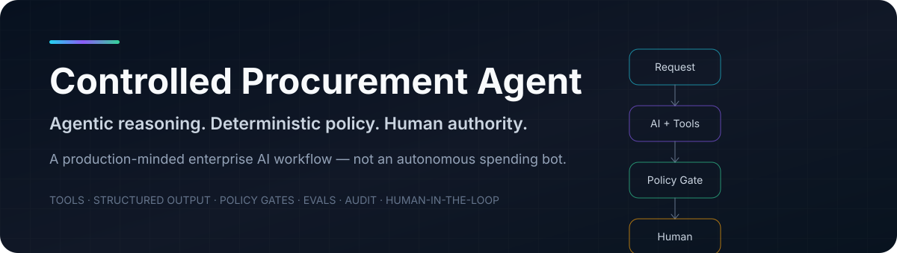
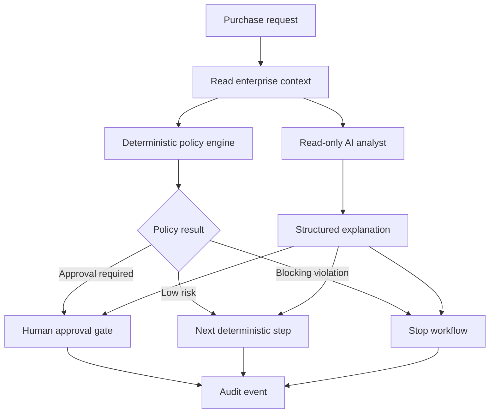

<p align="center">
  
</p>

<p align="center">
  
  
  
  
  <a href="https://controlled-procurement-agent.onrender.com/demo"></a>
  <a href="https://github.com/GonzAlex9/controlled-procurement-agent/actions/workflows/ci.yml"></a>
</p>

# Controlled Procurement Agent

A production-minded **agentic AI workflow for enterprise procurement**.

A purchase request enters the system. An AI analyst can inspect read-only enterprise context through tools and explain the case — but **budget rules, vendor controls, approval thresholds and execution authority remain deterministic**.

> **The agent can reason about a purchase. It cannot authorize one.**

### ▶ [Try the live demo](https://controlled-procurement-agent.onrender.com/demo)

Run the workflow in your browser with fictional enterprise data. No API key or setup required.

**13/13 automated tests · 5/5 deterministic regression evals · CI passing**

This project is intentionally designed around a real enterprise concern: how to get value from agentic AI **without turning probabilistic model behavior into business authority**.

## Why this project

The interesting problem is not generating a procurement summary. It is defining the boundary between:

- what an LLM should reason about;
- what software should enforce;
- what a human must approve;
- what needs to be observable and testable.

That boundary is where many enterprise AI systems either become trustworthy — or become dangerous.

## Workflow



## What the agent can and cannot do

| Capability | AI analyst | Deterministic system / human |
|---|---:|---:|
| Read vendor facts | ✅ | |
| Read department budget | ✅ | |
| Explain risks and evidence | ✅ | |
| Produce structured analysis | ✅ | |
| Decide approval thresholds | ❌ | ✅ Policy engine |
| Approve spend | ❌ | ✅ Human |
| Change vendor status | ❌ | ✅ Enterprise system |
| Reserve budget / place order | ❌ | ✅ Controlled execution layer |

The repository deliberately exposes **no purchase execution tool** to the model.

## Architecture principles

**1. Business authority stays deterministic**  
Thresholds, vendor restrictions, quote requirements and security reviews are normal code with normal tests.

**2. Tools are narrow and read-only**  
The model can retrieve the facts it needs, but tool permissions do not expand because the prompt asks nicely.

**3. Human approval is explicit state**  
Required approvers are calculated by policy. The model cannot impersonate or skip them.

**4. AI output is structured**  
The analyst returns a typed object: summary, risks, evidence and next step.

**5. The workflow works without AI**  
A deterministic explanation mode keeps CI, tests and policy evaluation reproducible without external model calls.

**6. Evaluation is split by failure mode**  
Exact regression tests protect policy behavior; model-quality evals focus on grounding, fidelity and action safety.

## Example policy behavior

The policy in this repository is **fictional demo policy**, not a policy from any employer or client.

Examples:

- small purchase + approved vendor + available budget → can pass deterministic checks;
- higher spend → manager / finance approval;
- high spend → CIO approval and additional quotes;
- software processing personal data → security review;
- unknown vendor → procurement review;
- blocked vendor or exceeded budget → reject.

See [`src/procurement_agent/policy.py`](./src/procurement_agent/policy.py).

## Deployment

**Public demo:** [controlled-procurement-agent.onrender.com/demo](https://controlled-procurement-agent.onrender.com/demo)

The repository includes a `render.yaml` Blueprint for a reproducible public deployment:

- Python 3.12
- Frankfurt region
- `/health` health check
- auto-deploy only after GitHub CI checks pass
- no OpenAI API key required for the public deterministic demo

[](https://render.com/deploy?repo=https://github.com/GonzAlex9/controlled-procurement-agent)

The public demo intentionally runs without a paid model key. AI-assisted analysis can still be enabled in a private deployment by setting `OPENAI_API_KEY`.

## Run locally

### 1. Install

```bash
python -m venv .venv
source .venv/bin/activate
pip install -e ".[dev,ai]"
```

### 2. Run tests and deterministic evals

```bash
make test
make eval
```

These require **no API key**.

### 3. Start the API

```bash
make run
```

Open the interactive portfolio demo at `http://localhost:8000/demo` (or simply `http://localhost:8000/`).

The FastAPI docs remain available at `http://localhost:8000/docs`.

### 4. Analyze a request without an LLM

```bash
curl -X POST 'http://localhost:8000/v1/purchase-requests/analyze' \
  -H 'Content-Type: application/json' \
  -d '{
    "id": "PR-2026-001",
    "requester": "demo.user",
    "department": "IT",
    "category": "saas",
    "vendor_id": "vendor-ai",
    "amount_eur": 7500,
    "justification": "Agentic workflow platform for a controlled enterprise pilot.",
    "quotes_count": 2,
    "contains_personal_data": true
  }'
```

### 5. Enable the real agentic analyst

```bash
export OPENAI_API_KEY="..."
export OPENAI_MODEL="gpt-5.6-sol"
```

Then call the same endpoint with `?use_ai=true`.

AI mode uses the **OpenAI Agents SDK** with read-only tools and structured output. SDK tracing can be used to inspect model calls and tool use.

## Interactive demo

The built-in reviewer UI lets you run three representative scenarios without any frontend setup:

- **Low risk** — approved vendor, available budget, no human approval required.
- **Human review** — medium-risk vendor / higher spend / personal-data handling.
- **Policy reject** — blocked vendor or other blocking condition.

The screen exposes the full decision path: enterprise context → deterministic policy → analyst narrative → human approval gate → audit trail. Human approvers can record approvals directly from the demo UI.

The UI is intentionally self-contained HTML/CSS/JavaScript served by FastAPI so the portfolio project remains easy to run and inspect.

## Human approval example

If policy requires approval, the workflow creates an approval gate. A human role then records an explicit decision:

```bash
curl -X POST 'http://localhost:8000/v1/approvals/PR-2026-001' \
  -H 'Content-Type: application/json' \
  -d '{
    "role": "manager",
    "actor": "manager@example",
    "approved": true,
    "note": "Business need confirmed."
  }'
```

Each analysis and approval action is visible through the demo audit endpoint.

## Evaluation

The first evaluation layer is deliberately deterministic:

```text
evals/cases.jsonl
        ↓
policy engine
        ↓
expected decision + expected approvers
        ↓
regression score
```

The next layer evaluates model behavior on:

`grounding` · `policy fidelity` · `action safety` · `risk recall` · `clarity` · `latency` · `cost`

Read [`docs/evaluation.md`](./docs/evaluation.md).

## Repository structure

```text
controlled-procurement-agent/
├── src/procurement_agent/
│   ├── analyst.py        # deterministic + OpenAI agent analyst
│   ├── api.py            # FastAPI surface
│   ├── models.py         # typed contracts
│   ├── policy.py         # authoritative deterministic rules
│   ├── store.py          # fictional enterprise context + approval state
│   └── workflow.py       # orchestration boundary
├── tests/                # deterministic unit/integration tests
├── evals/                # regression dataset + eval runner
├── docs/
│   ├── architecture.md
│   ├── evaluation.md
│   └── security.md
├── .github/workflows/ci.yml
├── Dockerfile
└── pyproject.toml
```

## Design trade-offs

This is deliberately **not** a multi-agent swarm. One specialist with narrow tools is easier to reason about, evaluate and secure. More agents would be added only when a concrete decomposition produces measurable value.

The demo uses an in-memory repository to keep the project runnable. Production integrations would sit behind explicit interfaces to ERP, IAM, vendor master, budgets and audit infrastructure.

There is also intentionally no RAG layer yet. Retrieval should be introduced when the workflow actually needs policy/document knowledge that cannot be represented as deterministic rules or direct enterprise data.

## Roadmap

- [x] Deterministic policy engine
- [x] Typed request / response contracts
- [x] Read-only agent tools
- [x] Structured model output
- [x] Human approval gate
- [x] Audit events
- [x] Deterministic regression evals
- [x] CI pipeline
- [x] Dockerized API
- [ ] Trace-based agent eval harness
- [ ] Prompt-injection / tool-abuse eval set
- [ ] MCP façade for selected read-only enterprise tools
- [ ] Persistent PostgreSQL repositories
- [ ] OpenTelemetry / vendor-neutral observability
- [x] Minimal reviewer UI

## Engineering position

The goal of the project is not to prove that an LLM can automate procurement.

It is to demonstrate a more useful proposition:

> **Agentic systems become enterprise systems when authority, state, evaluation and failure modes are engineered explicitly.**

---

<p align="center">
  <b>AI where judgment helps. Deterministic software where correctness matters. Humans where authority matters.</b>
</p>
